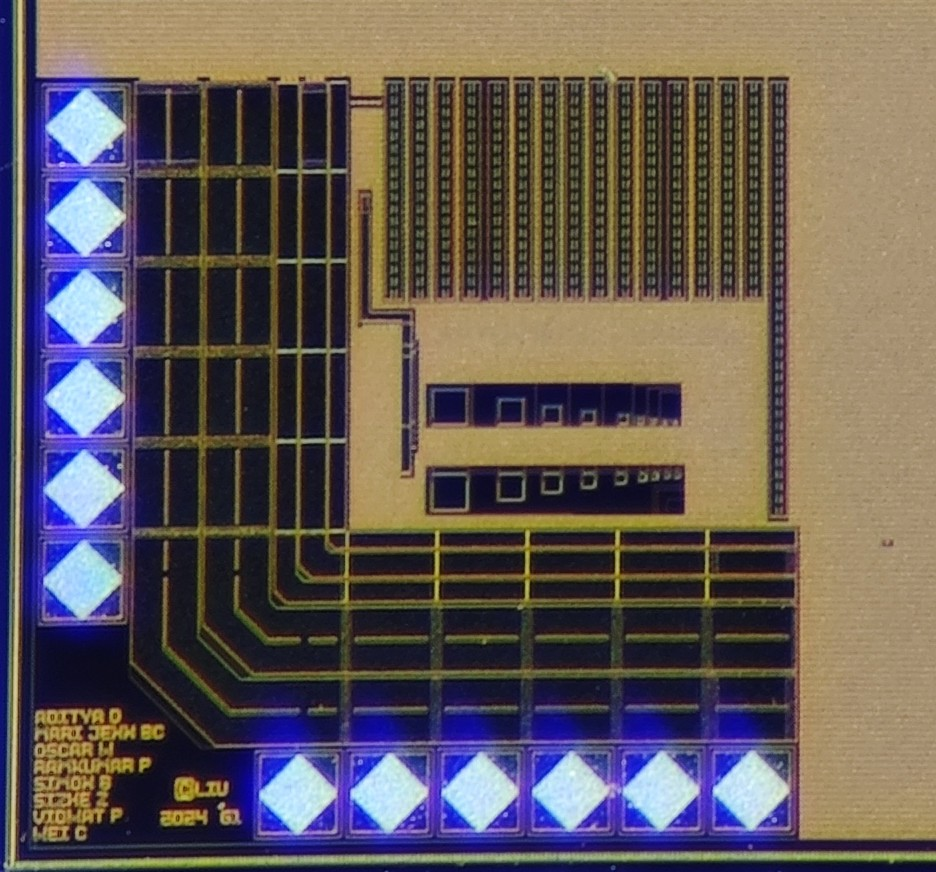
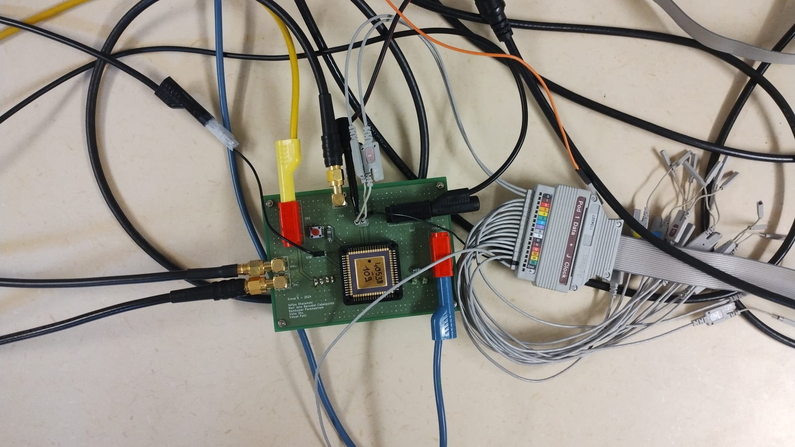
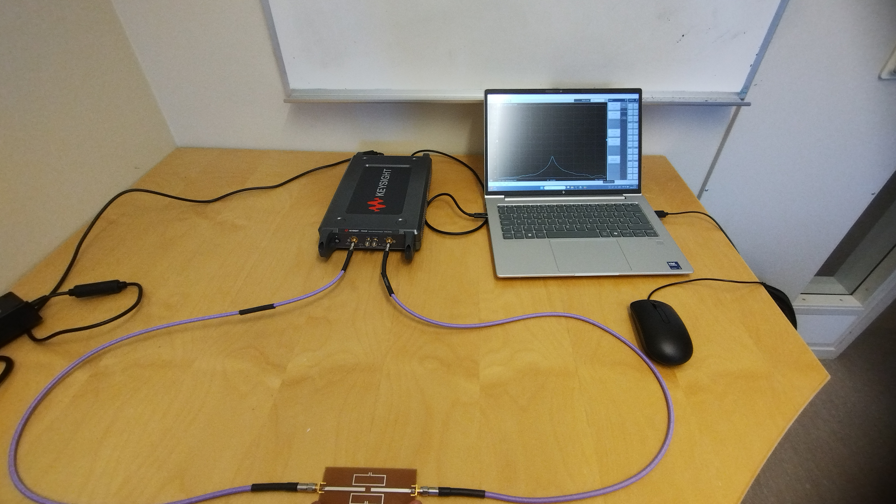
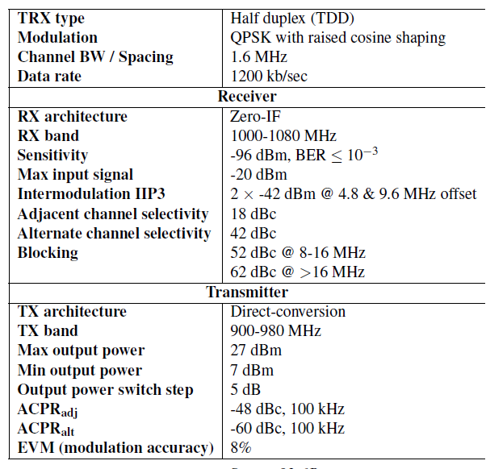

# Aditya R Dharamshi
"Electronics Engineer with a unique combination of hardware design and IC/chip design expertise."

👉 [Download My CV / Resume](docs/AdityaRD_CV.pdf)

1. 8-Bit Successive Approximation Register (SAR) ADC Chip Tapeout and Validation Project

This was one of the most comprehensive project courses in my Master's program, spanning from concept to silicon validation.
Phase 1 (4-Bit Ripple Counter): Designed a 4-bit ripple counter on a 350nm CMOS process. Handled the full flow from Verilog design to transistor-level schematics, layout, and simulations using Cadence Virtuoso. Completed the project with padframe integration and GDSII generation.
Phase 2 (8-Bit SAR ADC): Collaborated in a team to design an 8-bit SAR ADC. Personally designed the DAC transmission gates using Cadence Virtuoso and simulated them with Spectre. Contributed heavily to top-level routing and final padframe integration.
Silicon Validation: The final GDSII files were fabricated, and I successfully tested and validated the physical chip using a custom-designed evaluation board.

Our ADC design, as seen on the chip die under a microscope.

Lab evaluation of our chip on a custom PCB.

2. Master's Thesis: Microstrip-Based Resonator Sensor for Dielectric Sensing

Designed, implemented, and validated a high-precision microstrip resonator sensor used to detect and compare the dielectric properties of liquids, gels, and ice. The design is scalable for broader material classification.
Design & Simulation: Developed two split-ring rectangular resonators resonating at around 1 GHz using Keysight ADS and EMPro.
Fabrication & Test: Fabricated the physical prototype and validated its performance metrics using a Vector Network Analyzer (VNA

Lab evaluation of the sensor implemented on a PCB.

3. RF Transceiver Subsystem Design

Collaborated in a team to architect and design an RF transceiver at the physical (PHY) layer based on strict system-level specifications.
Transmitter Architecture: Designed a direct-conversion RF transmitter subsystem for a TDD half-duplex transceiver.
Receiver Integration: Assisted with the receiver subsystem engineering and integration.
Key Takeaways: Applied core RF system concepts to select components and tune parameters, gaining deep hands-on experience balancing practical design tradeoffs and performance bottlenecks.

Specs of the designed transceiver.

Bonus: Volunteering - Electronics Volunteer | SeeGoals, FIA Robotics (Linköping University, Sweden)

Volunteered as a hardware designer for a student-driven robotics organization, bridging the gap between hardware, firmware, and mechanical subsystems.
PCB Design: Analyzed, designed, and tested custom PCBs for an autonomous, football-playing robot.
Global Milestone: Our collective engineering efforts secured our team's qualification for RoboCup 2026, making us one of the very first teams representing Sweden to qualify.
